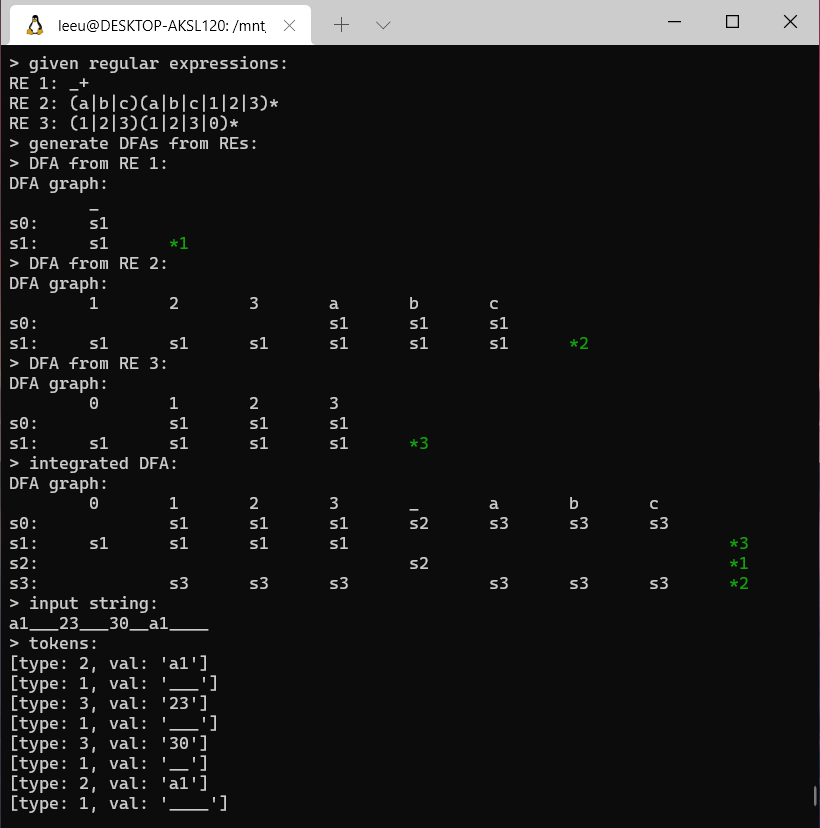
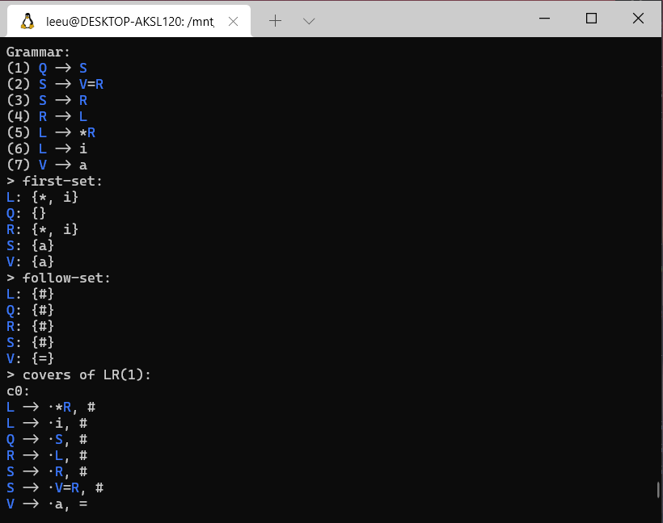
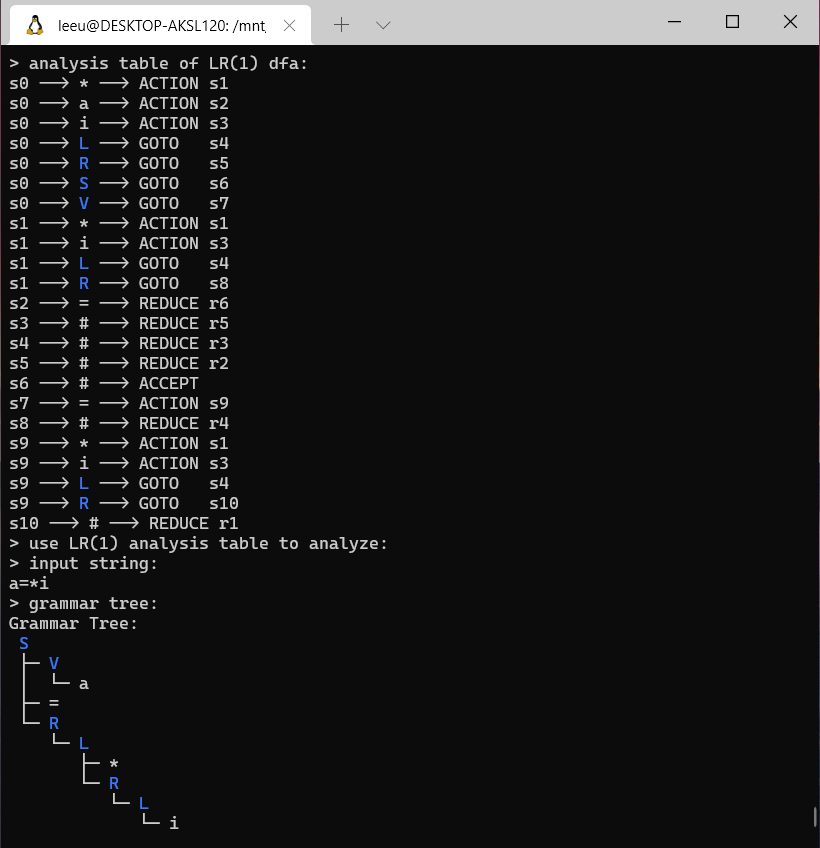

# Implementation of simple Syntax Analyzer and Lexical Analyzer

This is a toy compiler that only includes syntax analyzer and lexical analyzer. The step-to-step processing is visible so that it could be helpful for understanding the workflow of syntax analysis and lexical analysis. 







The implementation of algorithms are referenced to *Compilers Principles, Techniques, and Tools*.

## Usage

This project is expected to run on linux. It uses `Cmake` to help compile. 

```bash
$ cd build
$ cmake .
$ make
```

Some c++17 characteristics are utilized, thus you should make sure that your compiler support it. 

You will get 4 executables program under `./build/` after compiling. `syntax_demo` and `lexical_demo` can be exetuted without parameters. `syntax_test` and `lexical_test` take two files as necessary inputs. Examples of input files are prepared under `./example/`, you can rewrite them to get your own result. 

```bash
$ ./lexical_test ../example/grammar3.txt ../example/input3.txt
```

I've written a very simple regex engine to transfer regex into DFA, which can only deal with meta characters ranging from `()`, `+`, `*` and escape character `\`. It is far from handy as well as its implementation is not elegant. In my expectation, it would be better to use a static lexical analyzer to analyze it. Maybe it will be added later. 


